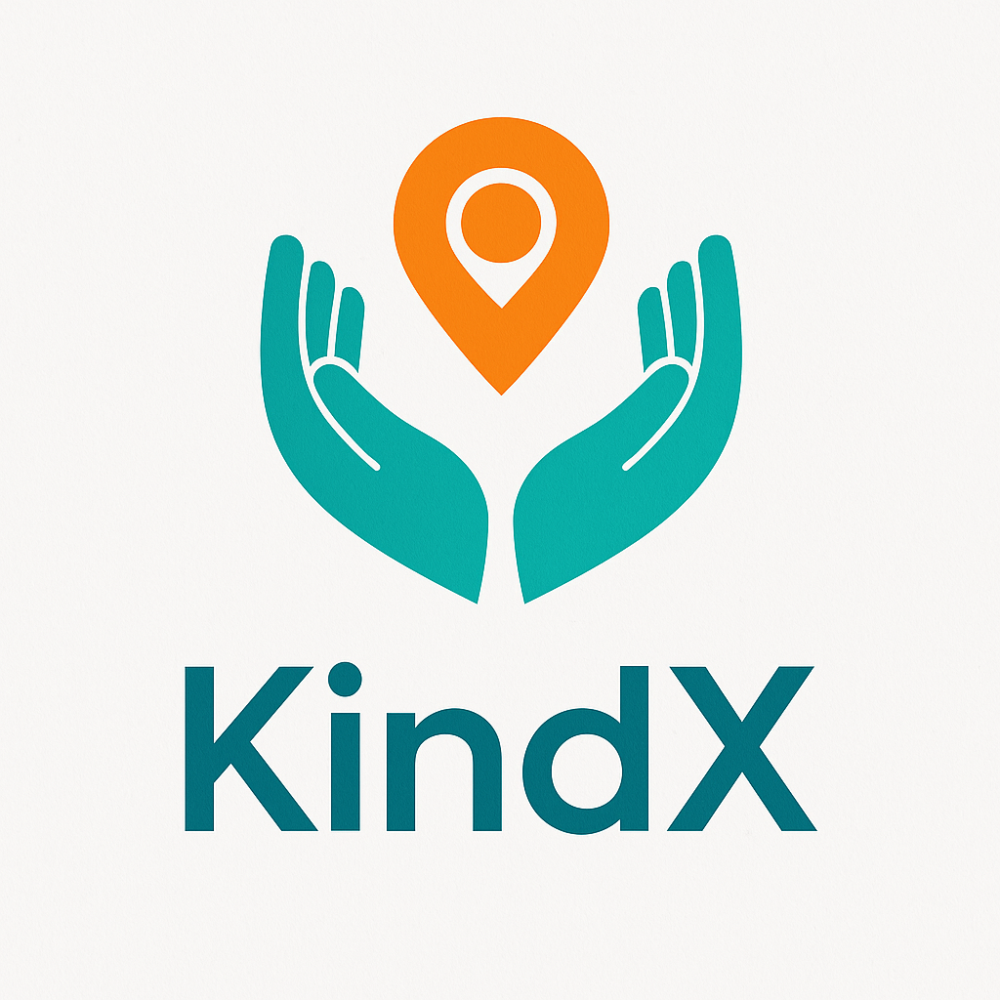

# 🌍 KindX

<p align="center">
  
</p>

<p align="center">
  <strong>Connecting people who need help with people willing to help nearby.</strong>
</p>

<p align="center">
  A community-driven mobile platform focused on social impact, local collaboration, and real-time help requests.
</p>

---

# 📱 About the Project

KindX is a mobile application designed to connect people who need help with people willing to help nearby.

The platform combines:

- 🤝 Community collaboration
- 📍 Geolocation
- 🗺️ Interactive maps
- ⚡ Real-time backend
- 🎯 User-centered experience

Users can:

- Request help
- Offer help
- Discover nearby community needs
- Explore requests and offers through an interactive map

Built with **React Native**, **Expo**, and **Supabase**, the project focuses on accessibility, scalability, and modern UX principles.

---

# ✨ Current Features

✅ Community feed  
✅ Help requests and offers  
✅ Interactive map with geolocation pins  
✅ Floating preview card on map selection  
✅ Detailed item screens  
✅ Request and offer filtering  
✅ Pull-to-refresh support  
✅ Floating action menu  
✅ Real-time backend with Supabase  
✅ Responsive mobile-first design  
✅ Modular architecture  
✅ Technical documentation  

---

# 🗺️ Interactive Map

The map experience includes:

- Dynamic pins for requests and offers
- Smooth camera animations
- Focused map mode
- Floating preview card
- Navigation to detail screens
- Future-ready route integration

Inspired by modern marketplace and booking applications.

---

# 🚀 Main Technologies

### Frontend
- React Native (Expo)
- TypeScript
- React Navigation
- React Native Maps

### Backend
- Supabase
- PostgreSQL
- Row Level Security (RLS)

### Architecture & Tooling
- Context API
- Modular structure
- Git & GitHub
- Semantic versioning
- Changelog documentation

---

# 🧱 Project Structure

```bash
src/
  screens/
  components/
  context/
  hooks/
  lib/
  theme/

docs/
```

### Highlights

- Organized UI by reusable components
- Centralized Supabase connection
- Future-ready authentication flow
- Documentation-first approach

---

# 🔐 Database Structure

## Requests
- id
- title
- description
- category
- location
- latitude
- longitude
- created_at

## Offers
- id
- type
- description
- location
- latitude
- longitude
- created_at

---

# 📄 Documentation

The project includes organized documentation inside `/docs`:

- CHANGELOG
- DECISIONS
- ROADMAP
- ARCHITECTURE

---

# 🧭 Roadmap

### Planned Features

- Google / Apple Login
- User profile system
- Real-time messaging
- Reputation and badges
- Push notifications
- Advanced map filters
- Route integration
- AI-powered suggestions
- Community moderation tools

---

# 🚀 Getting Started

## Clone repository

```bash
git clone https://github.com/renatovvjr/kindx.git
```

---

## Install dependencies

```bash
npm install
```

---

## Configure environment variables

Create a `.env` file:

```env
EXPO_PUBLIC_SUPABASE_URL=your_supabase_url
EXPO_PUBLIC_SUPABASE_ANON_KEY=your_supabase_anon_key
```

---

## Run the project

```bash
npx expo start -c
```

---

# 🎯 Vision

KindX aims to become a modern social impact platform where technology strengthens human connection, local collaboration, and mutual support.

The long-term vision is to create a scalable ecosystem capable of connecting communities worldwide through acts of kindness and practical assistance.

---

# 👨‍💻 Creator

## Renato Valle

Product & Business Analyst focused on user-centered digital solutions.

- Information Systems Graduate
- Economics & Finance Background
- UX-focused technology enthusiast
- Based in Sydney, Australia

---

# 📬 Contact

### GitHub
https://github.com/renatovvjr

### LinkedIn
https://www.linkedin.com/in/renato-valle-8455b23a/

### Email
renatovvjr@gmail.com

---

# ⭐ Support

If you like this project, consider giving it a ⭐ on GitHub.